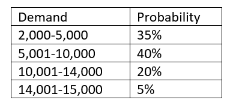

```{r setup, include=FALSE}
knitr::opts_chunk$set(echo = TRUE)
```

Importing relevant libraries to answer the assignment question

```{r Importing Relevant Library, warning=FALSE, message=FALSE}
library(tidyverse)
library(stats)
library(triangle)
library(fitdistrplus)
```

Profit is calculated by using formula Profit = Revenue - Total Cost

In the context of GWS profit, calculation for the total expected profit for GWS with several production scenarios (4000, 8000, 12000, and 15000 boats) could be modeled by modeling the variables that affect the profit as follows: 

1. Revenue

As suggested by the assignment question, GWS is expecting the demand to be somewhere between 2,000 and 15,000, with probabilities as shown in below table 
{style="display:block; margin:auto;"}

Above demands scenario could be modeled using the Breakpoints Method and then the Revenue could be modeled using following equation:

Revenue = Demand Distribution * Selling Price

Below code will be used to estimate the Revenue for each of the production scenario. Note that for each of the production scenario, 10,000 Monte Carlo simulation will be conducted:

```{r Revenue}
# Setting seed for reproducibility
set.seed(616)

# Creating vector of expected probabilities and associated demands
probs <- c(0.35, 0.75, 0.95, 1)
ints <- c(2000, 5001, 10001, 14001, 15000)

# Creating vector of production scenarios
boat_production <- c(4000, 8000, 12000, 15000)

#Assigning variables to sale price of a boat
sale_price <- 250000

# Assigning number of Monte Carlo Iterations
n <- 10000

# Assigning uniformly generated random number to a variable for a probability of demand occurring 
p <- runif(n)

# Estimating demand by creating breakpoints distribution using dplyr case_when
demand <- case_when(p<probs[1]~runif(n,ints[1],ints[2]),
               p<probs[2]~runif(n,ints[2],ints[3]),
               p<probs[3]~runif(n,ints[3],ints[4]),
               p<probs[4]~runif(n,ints[4],ints[5]))
hist(demand)

# Creating function to calculate expected revenue
expected_revenue <- function(number_production){
  rv_demand <- demand
  m_rev <- rv_demand - number_production
  revenue <- ifelse(m_rev>0, number_production*sale_price, rv_demand*sale_price)
  return(revenue)
}

# Calculating revenue for all four production scenarios
revenue_all <- lapply(boat_production, expected_revenue)
str(revenue_all)
```

2. Fixed Cost

As explained in the assignment prompt, The fixed cost of manufacturing any number of boats is normally distributed, with a mean of 300 million dollar and a standard deviation of 60 million dollar. Therefore, Fixed Cost could be modeled by using Normal Distribution.

Below code will be used to model the fixed cost to manufacture the boat as a normal distribution.

```{r fixed cost}
set.seed(616)
fixed_cost <- rnorm(n=n, mean=300000000, sd=60000000)
hist(fixed_cost, main="Histogram of the Fixed Cost", xlab="Total Fixed Cost(USD")
```

3. Variable Cost

The company expect that the variable cost to produce one boat will be a minimum of 77 thousand dollar and a maximum of 100 thousand dollar, with a most likely value of 90,000 dollar. The variable cost could therefore be modeled using the Triangular Distribution.

Below code will be used to model the variable cost using Triangular Distribution

```{r Variable Cost}
variable_cost <- function(number_production){
  set.seed(616)
  variablecost_rv <- rtriangle(n=10000, a=77000, b=100000, c=90000)
  var_cost <- number_production * variablecost_rv
  return(var_cost)}

# Calculating variable cost for each of the production scenario
variable_cost_all <- lapply(boat_production, variable_cost)
str(variable_cost_all)

# Checking the histogram of one of the production scenario variable cost
hist(variable_cost_all[[1]], main="Total Variable Cost Histogram for 4000 Boats Production", xlab="Total Variable Cost(USD)")
```

4. Total Cost

Total cost to manufacture a boat will be the total of the fixed cost and variable cost. Below code will be used to calculate the total cost to manufacture the boat for each of the production scenario.

```{r Question 1 Total Cost}
total_cost <- lapply(variable_cost_all, function(x) x + fixed_cost)
str(total_cost)

# Checking the histogram of one of the production scenario total cost
hist(total_cost[[1]], main="Histogram of Total Cost for 4000 Boats Production")
```
After modeling each of the components from the profit equation, the profit distribution for each of the production scenario are as follow:

```{r Profit Distribution Calculation}
profit_all <- Map("-", revenue_all, total_cost)
str(profit_all)
```

Plotting the histogram and calculating mean & standard deviation for each of the production scenarios

1. 4000 Boats Production
```{r 4000 boats}
# Histogram
hist(profit_all[[1]], main="Profit Distribution of 4000 Boats Production", xlab="Profit(USD)")
# Mean
paste("Mean of profit(loss) for 4000 boats production is (USD):",mean(profit_all[[1]])%>%round(2))
# Standard Deviation
paste("Standard Deviation of profit(loss) for 4000 boats production is (USD):", sd(profit_all[[1]])%>%round(2))
```

2. 8000 Boats Production
```{r 8000 boats}
# Histogram
hist(profit_all[[2]], main="Profit Distribution of 8000 Boats Production", xlab="Profit(USD)")
# Mean
paste("Mean of profit(loss) for 8000 boats production is (USD):",mean(profit_all[[2]])%>%round(2))
# Standard Deviation
paste("Standard Deviation of profit(loss) for 8000 boats production is (USD):", sd(profit_all[[2]])%>%round(2))
```

3. 12000 Boats Production
```{r 12000 boats}
# Histogram
hist(profit_all[[3]], main="Profit Distribution of 12000 Boats Production", xlab="Profit(USD)")
# Mean
paste("Mean of profit(loss) for 12000 boats production is (USD):",mean(profit_all[[3]])%>%round(2))
# Standard Deviation
paste("Standard Deviation of profit(loss) for 12000 boats production is (USD):", sd(profit_all[[3]])%>%round(2))
```

4. 15000 Boats Production
```{r 15000 boats}
# Histogram
hist(profit_all[[4]], main="Profit Distribution of 15000 Boats Production", xlab="Profit(USD)")
# Mean
paste("Mean of profit(loss) for 15000 boats production is (USD):",mean(profit_all[[4]])%>%round(2))
# Standard Deviation
paste("Standard Deviation of profit(loss) for 15000 boats production is (USD):", sd(profit_all[[4]])%>%round(2))
```
